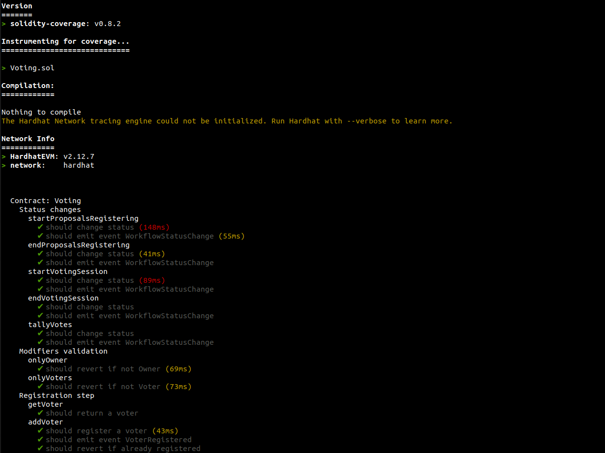
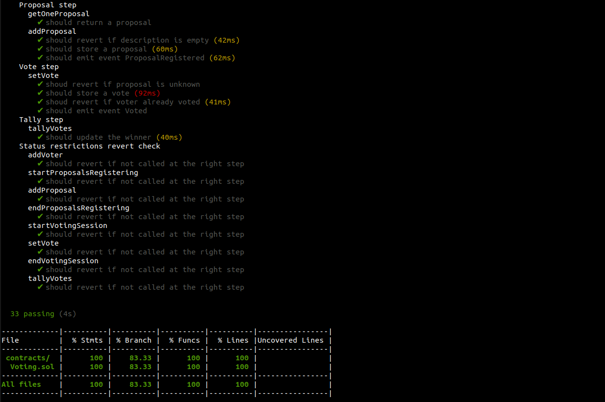

# Voting smart contract tests
Tests for the Voting smart contract

## List of tests performed
    * modifiers
        * onlyOwner
        * onlyVoters
    
    * GETTERS
        * getVoter
        * getOneProposal

    * REGISTRATION
        * addVoter
            * revert wrong status
            * revert already registered
            * check storage
            * emit event VoterRegistered

    * PROPOSAL
        * addProposal
            * revert wrong status
            * revert empty desc
            * check storage
            * emit event ProposalRegistered

    * VOTE
        * setVote
            * revert wrong status
            * revert empty desc
            * check storage
            * emit event Voted
    
    * STATUS
        * startProposalsRegistering
            * revert wrong status
            * check storage
            * emit event WorkflowStatusChange
        * endProposalsRegistering
            * revert wrong status
            * check storage
            * emit event WorkflowStatusChange
        * startVotingSession
            * revert wrong status
            * check storage
            * emit event WorkflowStatusChange
        * endVotingSession
            * revert wrong status
            * check storage
            * emit event WorkflowStatusChange
        * tallyVotes
            * revert wrong status
            * check storage
            * emit event WorkflowStatusChange  

## Tests with Truffle suite
### Output of `truffle test` command

## Tests with Hardhat suite
### Output of `npx hardhat coverage` command

